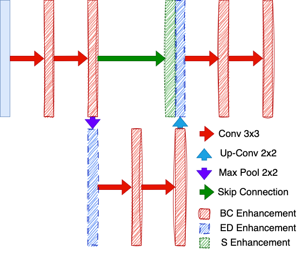
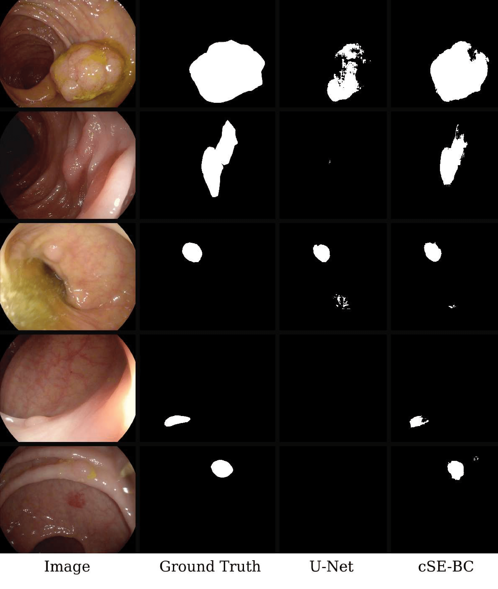
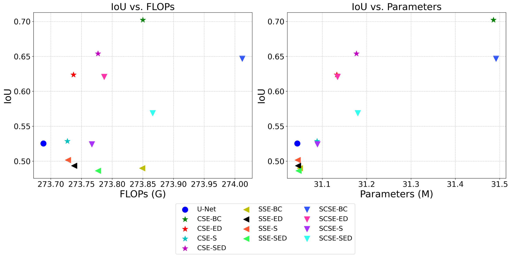

# EbAU-Net: Enhanced by Attention U-Net 

## Overview

EbAU-Net (Enhanced by Attention U-Net) integrates channel and spatial attention mechanisms into the U-Net architecture to improve segmentation performance. This model has been evaluated on multiple medical imaging datasets, demonstrating notable improvements in accuracy with minimal computational overhead.

## Related Paper

This repository accompanies the paper:
"Enhancing U-Net with Attention Mechanisms for Medical Image Segmentation"

The paper provides an in-depth analysis of the proposed modifications, detailing how different attention mechanisms impact segmentation performance across diverse datasets.

### Abstract:
Medical image segmentation plays a vital role in numerous applications and has gained significant attention since the introduction of the U-Net model, which enabled convolutional neural networks to achieve high performance with manageable computational costs. Recently, attention mechanisms have emerged as a promising approach to enhance model performance by emphasizing relevant features while suppressing irrelevant ones. This study explores the integration of channel and spatial attention mechanisms into the U-Net architecture, evaluating their impact on segmentation performance and computational cost. Experiments conducted on six public medical imaging datasets demonstrated performance improvements, with Intersection over Union (IoU) gains ranging from **1.68%** to **33.66%** compared to the original U-Net. These results highlight the potential of attention mechanisms to significantly improve the efficiency and effectiveness of medical image segmentation models.

#### Key Words:
Attention Mechanism, Medical Images Segmentation, U-Net, Computer Vision.

---

## Repository Structure

In addition to the code files, the repository expects a folder named `data`, which should contain the **training** and **testing** datasets. Each dataset must have separate subfolders for:

* **Input images** (e.g., `image`)
* **Segmentation masks** (e.g., `mask`)

The expected structure is:

```
data/
├── train/
│   ├── image/
│   └── mask/
└── test/
    ├── image/
    └── mask/
```

## Model Implementations

The repository includes several implementations based on the original U-Net model, with different attention mechanisms integrated into the convolutional layers. The file names indicate the specific attention mechanisms used in each model:

* **modelOriginal**: This corresponds to the original U-Net implementation.
* **AllConv2**: This implementation applies attention mechanisms between convolutions (BC - **Between Convolutional** approach).
* **Encoder\_Decoder**: This model applies attention mechanisms to the upsampling and downsampling processes (ED - **Encoder-Decoder** approach).
* **Skip**: This implementation integrates the attention mechanism into the skip connections (S - **Skip Connection** approach).
* **Skip\_Encoder\_Decoder**: This model combines the two previous approaches, applying attention both in the skip connections and the upsampling/downsampling steps (SED - **Skip Encoder-Decoder** approach).



Additionally, the first word following "model" in the file names indicates the type of attention mechanism applied:

* **cSE**: Spatial Squeeze and Channel Excitation
* **sSE**: Channel Squeeze and Spatial Excitation
* **csSE**: Concurrent Spatial and Channel Squeeze and Excitation

## Script Descriptions

* **train.py**: This script trains all the models.
* **test.py**: This script evaluates all the models using the main metrics discussed in the paper.
* **predict.py**: This script generates predicted images from the models.
* **tflop.py**: This script calculates the computational complexity of the models.

## Utility Files

* **utils.py**: Implements basic utility functions required for the other scripts to run.
* **data.py**: Contains data preprocessing functions to load and prepare datasets for training and evaluation.
* **loss.py**: Defines the loss functions used during model training.

---

## Results

### Table 1: Average metrics of the models studied in this work for polyp segmentation in colonoscopy image datasets.

| **Model**   | **ETIS-LaribPolypDB** IoU | **ETIS-LaribPolypDB** DICE | **ETIS-LaribPolypDB** Recall | **CVC-ColonDB** IoU | **CVC-ColonDB** DICE | **CVC-ColonDB** Recall |
|-------------|----------------------------|----------------------------|------------------------------|---------------------|----------------------|------------------------|
| U-Net       | 0.5253                     | 0.5878                     | 0.5602                       | 0.6691              | 0.7403               | 0.7003                 |
| cSE-BC      | **0.7021**                 | **0.7783**                 | **0.7720**                   | 0.7766              | 0.8431               | 0.8241                 |
| cSE-ED      | 0.6237                     | 0.6951                     | 0.6732                       | 0.7746              | **0.8441**           | **0.8270**             |
| cSE-S       | 0.5286                     | 0.5962                     | 0.5626                       | 0.6830              | 0.7529               | 0.7130                 |
| cSE-SED     | 0.6540                     | 0.7282                     | 0.7254                       | 0.7694              | 0.8372               | 0.8318                 |
| sSE-BC      | 0.4899                     | 0.5546                     | 0.5159                       | 0.6986              | 0.7687               | 0.7317                 |
| sSE-ED      | 0.4935                     | 0.5610                     | 0.5255                       | 0.6814              | 0.7567               | 0.7141                 |
| sSE-S       | 0.5017                     | 0.5681                     | 0.5292                       | 0.6753              | 0.7475               | 0.7063                 |
| sSE-SED     | 0.4863                     | 0.5590                     | 0.5189                       | 0.6822              | 0.7548               | 0.7185                 |
| scSE-BC     | 0.6467                     | 0.7213                     | 0.7110                       | **0.7786**          | 0.8439               | 0.8230                 |
| scSE-ED     | 0.6207                     | 0.6903                     | 0.6686                       | 0.7497              | 0.8143               | 0.7907                 |
| scSE-S      | 0.5243                     | 0.5937                     | 0.5569                       | 0.7007              | 0.7708               | 0.7331                 |
| scSE-SED    | 0.5688                     | 0.6435                     | 0.6129                       | 0.7704              | 0.8343               | 0.8107                 |

---

### Table 2: Average metrics of the models studied for retinal vessel segmentation datasets.

| **Model**   | **DRIVE** IoU | **DRIVE** DICE | **DRIVE** Recall | **RITE** IoU | **RITE** DICE | **RITE** Recall |
|-------------|---------------|----------------|------------------|--------------|---------------|-----------------|
| U-Net       | 0.5637        | 0.7205         | 0.6219           | 0.5836       | 0.7365        | 0.6424          |
| cSE-BC      | 0.5840        | 0.7370         | **0.6614**       | **0.6018**   | **0.7511**    | **0.6833**      |
| cSE-ED      | 0.5807        | 0.7343         | 0.6488           | 0.5999       | 0.7496        | 0.6764          |
| cSE-S       | 0.5613        | 0.7184         | 0.6212           | 0.5861       | 0.7385        | 0.6511          |
| cSE-SED     | 0.5738        | 0.7288         | 0.6421           | 0.5927       | 0.7439        | 0.6686          |
| sSE-BC      | 0.5654        | 0.7217         | 0.6286           | 0.5854       | 0.7380        | 0.6547          |
| sSE-ED      | 0.5689        | 0.7247         | 0.6366           | 0.5818       | 0.7352        | 0.6481          |
| sSE-S       | 0.5536        | 0.7120         | 0.6088           | 0.5726       | 0.7276        | 0.6278          |
| sSE-SED     | 0.5525        | 0.7109         | 0.6113           | 0.5755       | 0.7299        | 0.6360          |
| scSE-BC     | **0.5862**    | **0.7388**     | 0.6578           | 0.6005       | 0.7500        | 0.6746          |
| scSE-ED     | 0.5753        | 0.7300         | 0.6395           | 0.5946       | 0.7454        | 0.6619          |
| scSE-S      | 0.5619        | 0.7190         | 0.6180           | 0.5841       | 0.7370        | 0.6444          |
| scSE-SED    | 0.5689        | 0.7248         | 0.6293           | 0.5937       | 0.7446        | 0.6643          |

---

### Table 3: Average metrics of the models studied for lung segmentation datasets.

| **Model**   | **MCSZ** IoU | **MCSZ** DICE | **MCSZ** Recall | **RSU** IoU | **RSU** DICE | **RSU** Recall |
|-------------|--------------|---------------|-----------------|-------------|--------------|----------------|
| U-Net       | 0.8290       | 0.8905        | 0.8648          | 0.9128      | 0.9445       | 0.9322         |
| cSE-BC      | 0.8954       | 0.9412        | **0.9413**      | **0.9234**  | **0.9529**   | 0.9444          |
| cSE-ED      | **0.8984**   | **0.9438**    | 0.9405          | 0.9196      | 0.9505       | **0.9464**      |
| cSE-S       | 0.7916       | 0.8570        | 0.8249          | 0.9115      | 0.9441       | 0.9365         |
| cSE-SED     | 0.8902       | 0.9377        | 0.9265          | 0.9171      | 0.9490       | 0.9383         |
| sSE-BC      | 0.8518       | 0.9105        | 0.8818          | 0.9149      | 0.9490       | 0.9386         |
| sSE-ED      | 0.7984       | 0.8721        | 0.8279          | 0.9167      | 0.9484       | 0.9349         |
| sSE-S       | 0.8094       | 0.8672        | 0.8387          | 0.9167      | 0.9484       | 0.9349         |
| sSE-SED     | 0.7868       | 0.8546        | 0.8168          | 0.9036      | 0.9406       | 0.9267         |
| scSE-BC     | 0.8839       | 0.9329        | 0.9256          | 0.9165      | 0.9482       | 0.9373         |
| scSE-ED     | 0.8745       | 0.9268        | 0.9097          | 0.9131      | 0.9459       | 0.9349         |
| scSE-S      | 0.8221       | 0.8868        | 0.8540          | 0.9157      | 0.9474       | 0.9356         |
| scSE-SED    | 0.8771       | 0.9284        | 0.9142          | 0.9182      | 0.9497       | 0.9409         |

### Qualitative Results on ETIS-LaribPolypDB



### Complexity Analysis




## Citation

If you use this repository in your research, please cite our paper:

E. S. Honorato, M. A. S. Uchida, A. J. M. Traina and D. F. Wolf, "Improving U-Net with Attention Mechanism for Medical Image Segmentation Applications," 2025 IEEE 38th International Symposium on Computer-Based Medical Systems (CBMS), Madrid, Spain, 2025, pp. 264-269, doi: 10.1109/CBMS65348.2025.00060. keywords: {Image segmentation;Attention mechanisms;Computational modeling;Lungs;Computer architecture;Retina;Distance measurement;Computational efficiency;Convolutional neural networks;Biomedical imaging;Attention Mechanism;Medical Images Segmentation;U-Net;Computer Vision},

